# 天气如风景

传统气象站通常将传感器读数显示为原始数值数据。浏览这些仪表板可能会让人感到不知所措和压力很大，因为它需要付出巨大的努力才能有效地定位、解释和可视化特定参数。

人眼观看风景图像感觉很自然。观察景观元素的平静效果可以减轻压力，并且不需要付出太多的努力，从而获得更轻松的视觉体验。

**编码原理**

下面的方法演示了如何在景观图像中编码天气信息，而不依赖或最小程度地依赖数值数据。

风景描绘了树林中的一座小房子。图像的横轴代表24小时的时间线，从左侧当前时刻开始，以房屋为标记，一直延伸到右侧第二天的状况。沿垂直轴分布的各种景观元素象征着天气事件和条件。时间距离现在越远，它在图像中的位置就越靠右。

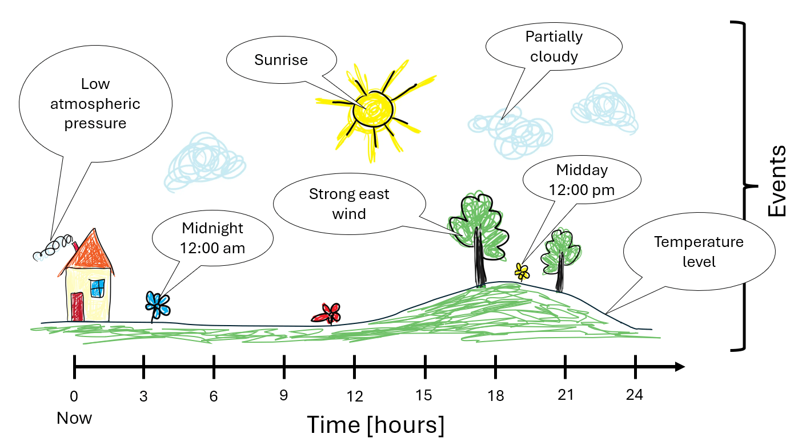

可以在风景图像中编码以下信息：

- 简化时间线导航的时间标记：
  - 日出和日落时间
  - 中午和午夜
- 天气预报信息：
  - 风向和强度
  - 温度波动
  - 最高和最低温度值
  - 云层覆盖
  - 沉淀
- 目前天气状况：
  - 温度
  - 气压
- 非天气事件：
  - 生日
  - 假期

**具体执行**

图像生成代码是使用 Pillow 库用 Python 编写的，并且基于 OpenWeather 的数据。该图像专为在 296x128 电子墨水显示屏上使用而设计。代码在 Python 3.9 上测试。

| 活动图片 | 描述 |
|:-|:-|
| | 日出 | 
|  | 日落 |
|  | 云层覆盖 |
|  | 当前时间位置 |
|  | 午夜 |
|  | 正午 |
|  | 南风 |
|  | 东风 |
|  | 西风 |
| 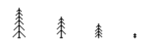 | 北风 |
|  | 雨 |
|  | 雪 |

树越高，预计风就越强。森林中不同树种的混合表明风向中等。

**例子**

| 风景图片 | 描述 |
|:-|:-|
|  | 现在是中午左右，预计天空晴朗，有几朵云。夜间将有温和的北风。目前气温正在上升，但日落后将开始下降，在日出前达到最低点。在此期间，预计风向将转向东北。|
| 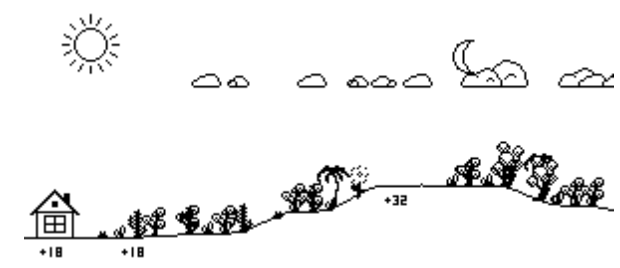 | 太阳正在升起，这将是一个炎热的晴天，有轻微的东南风。即使日落后气温仍将很高，风向将转向东风，整个晚上变得更强。|
| 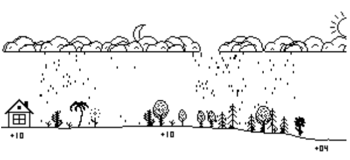 | 白天和晚上都会寒冷多雨。夜间南风将转为东北风。|

> https://github.com/lds133/weather_landscape?tab=readme-ov-file

## 行业动态

1、Vue的作者成立新公司 Voidzero.dev

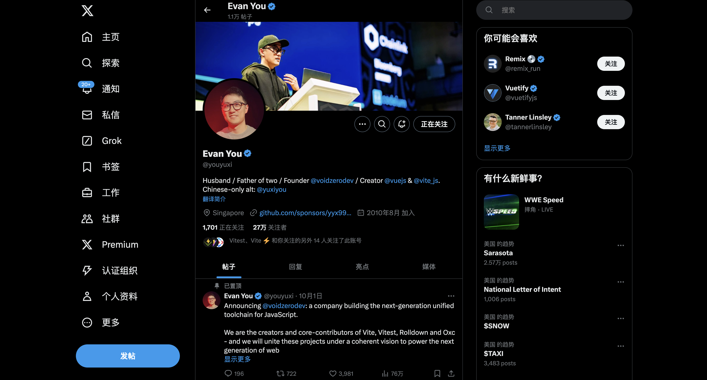

10月1日，voidzerodev 是一家为 JavaScript 构建下一代统一工具链的公司。公司致力于 Vite、Vitest、Rolldown 和 Oxc 的创建和贡献，将在一个一致的愿景下将这些项目联合起来，为下一代 Web 应用程序提供动力。目前已筹集了 460 万美元的种子资金。

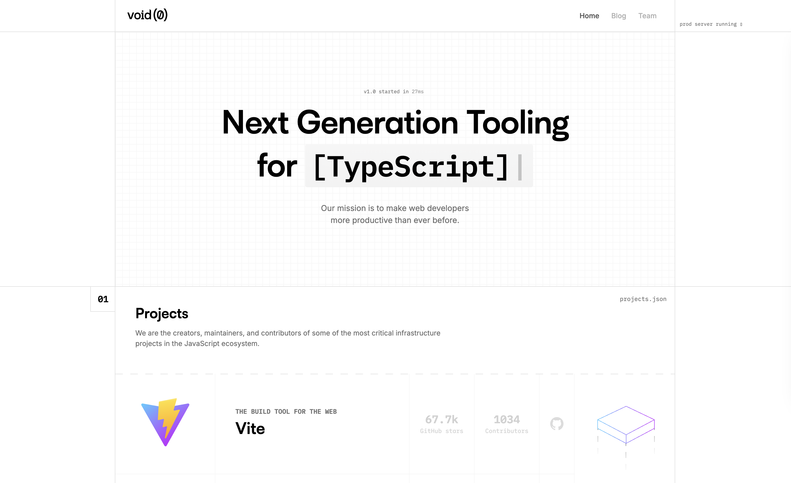

2、Deno 2.0 发布了

Deno 2.0 主要通过几个方面进行改进：首先，它显著提升了启动时间和运行性能；其次，引入了更灵活的模块导入方式，简化了依赖管理；此外，TypeScript 支持得到了增强，改进了类型推断，使开发更加高效；最后，Deno 2.0 强调了与开发工具的集成，如调试和测试工具，同时鼓励社区反馈和参与，推动项目的持续发展。

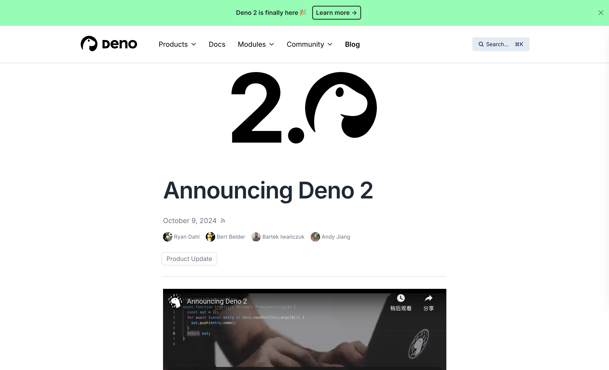

> https://deno.com/blog/v2.0

3、GitHub Copilot 提供完整路径

现在只需使用“#”即可在 GitHub Copilot 聊天中提及任何文件。提供完整路径。当每个 API 端点都命名为“index”时很有帮助。

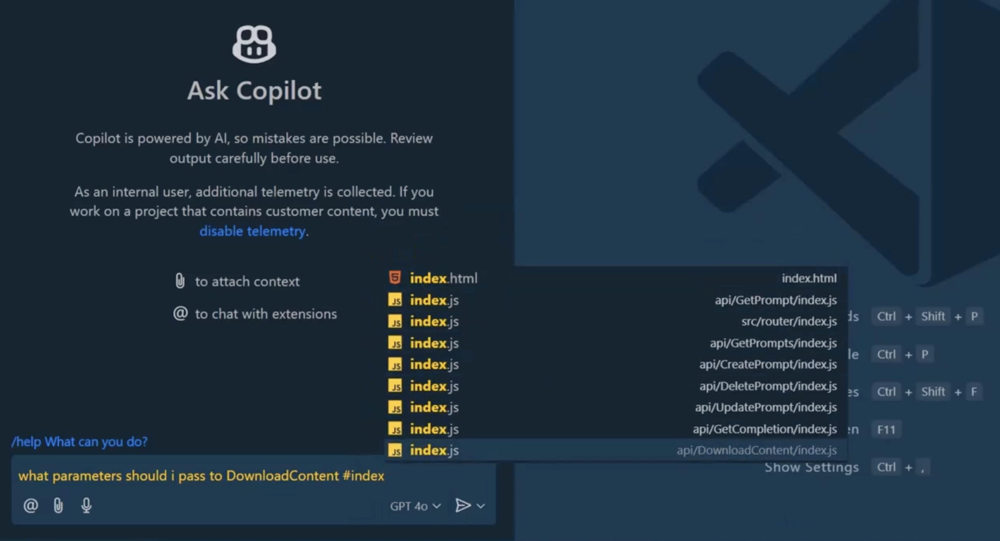

4、上海图书馆，塞不下的中年的凡人歌

这篇文章描述了上海图书馆东馆作为许多人自我提升和职业转型的场所。文章提到，在工作日早晨，人们会在图书馆门口排起长队，等待进入这个拥有6000个座位、但常常一位难求的地方开始一天的学习或工作。这些访客中包括准备考试的学生、寻求职业发展的中年人以及退休后继续学习的老年人。文章还特别提到了两位人物：Linda是一位曾经的职业女性，经历了从高职位到待业在家的转变；蔡文理则是一个有股市投资背景的人，他将图书馆视为一个暂时的避风港，同时也在观察着股市的变化。整体上，文章通过描绘不同人物的故事，反映了当前社会环境下人们对未来不确定性的感受以及对个人成长不懈追求的态度。

> https://www.36kr.com/p/2985195398258432

## 技术文章

1、使用 Tauri 构建跨平台应用程序（英文）

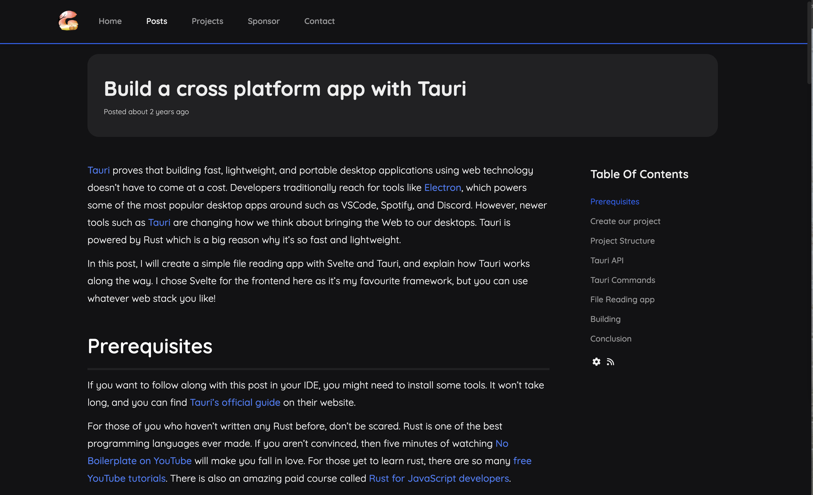

Tauri 证明使用 Web 技术构建快速、轻量级和便携式桌面应用程序并不需要付出代价。在这篇文章中，我将使用 Svelte 和 Tauri 创建一个简单的文件读取应用程序，并解释 Tauri 的工作原理。我在这里选择 Svelte 作为前端，因为它是我最喜欢的框架，但您可以使用您喜欢的任何 Web 堆栈！

> https://ghostdev.xyz/posts/build-a-cross-platform-app-with-tauri/

2、如何阅读机器学习研究论文（英文）

刚开始阅读机器学习研究论文的人常常会不知所措。他们试图从头到尾读完，但往往在读完之前就放弃了。以下是有关如何有效阅读研究论文以帮助您理解材料的建议。

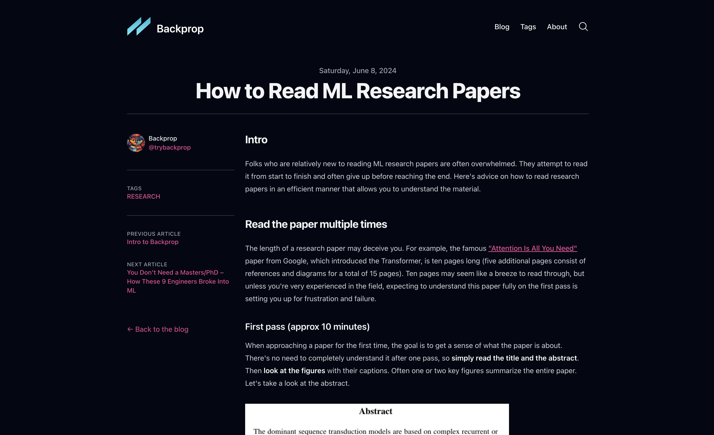

> https://www.trybackprop.com/blog/2024_06_08_how_to_read_ml_research_papers

3、感激不尽：console.log() 中的颜色（英文）

在用户界面中单击并观察错误。问题是，当我查看控制台以查看 UI 正在执行的操作是否与代码正在执行的操作相匹配时，无法判断。这些值难以辨别，因为我无法读取 HSL。这篇文章作者通过 console.log() 来解决这个问题。

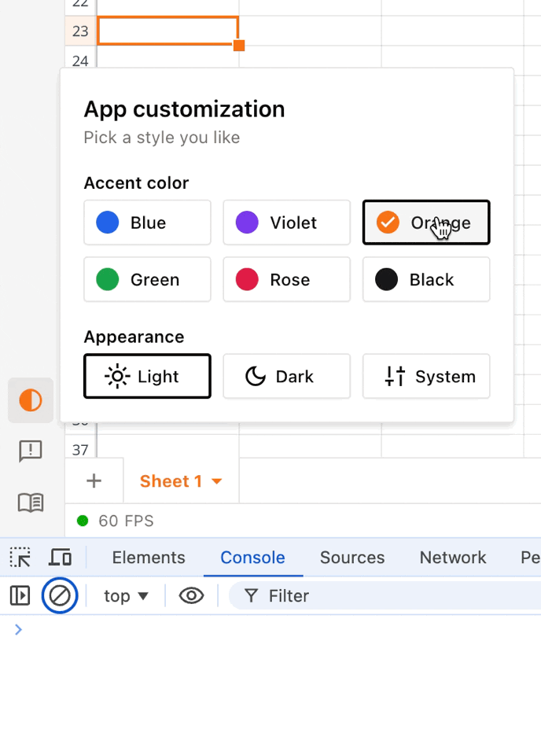

> https://blog.jim-nielsen.com/2024/color-console-log/

4、Web 常见的三个安全问题

这篇文章讨论了网络安全的重要性，介绍了常见的网络威胁（如恶意软件和网络钓鱼），并强调了采取强密码、定期更新和提高用户意识等安全措施。它还提到技术进步带来的新挑战，呼吁持续更新防护策略。

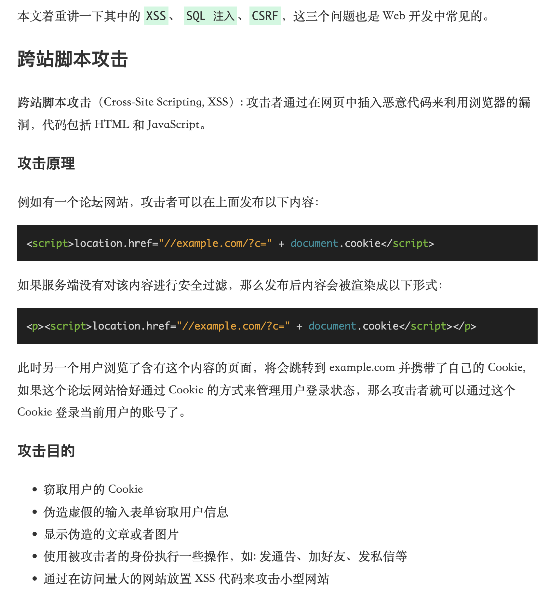

> https://dbwu.tech/posts/web_security/

## 工具&资源

1、UptimeFlare 是一个在线的监控网站，由 Cloudflare Workers 驱动。

> https://github.com/lyc8503/UptimeFlare

2、LosslessCut 旨在成为终极跨平台 FFmpeg GUI，可对视频、音频、字幕和其他相关媒体文件进行极快速且无损的操作。

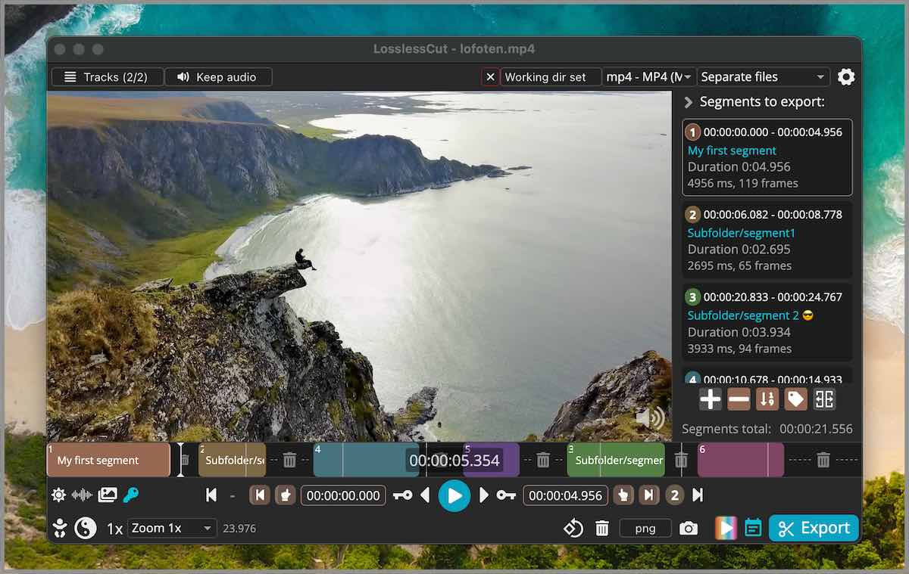

主要功能是对视频和音频文件进行无损修剪和剪切，这对于通过粗剪从摄像机、GoPro、无人机等拍摄的大型视频文件来节省空间非常有用。它可以让您快速从您的视频中提取出好的部分。视频并丢弃许多 GB 的数据，而不进行缓慢的重新编码，从而损失质量。或者，您可以将音乐或字幕轨道添加到视频中，而无需编码。一切都非常快，因为它几乎是直接进行数据复制，并由出色的 FFmpeg 推动，FFmpeg 完成了所有繁重的工作。

> https://github.com/mifi/lossless-cut

3、JS代码覆盖率工具，用来生成原生的V8或者Istanbul代码覆盖率报告。

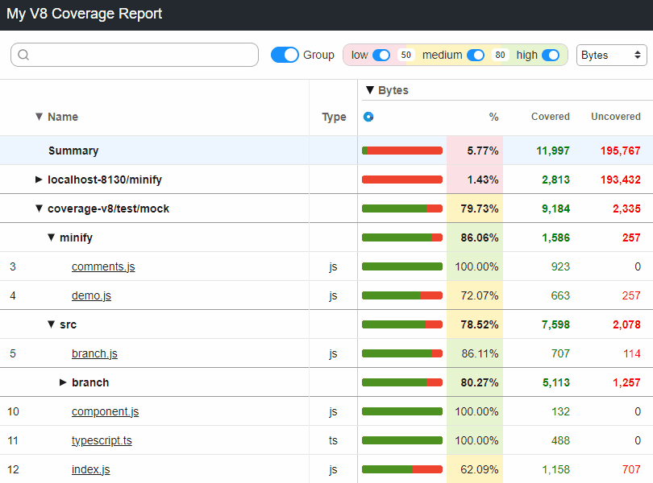

> https://github.com/cenfun/monocart-coverage-reports/

4、五子棋人机对战游戏 - 经典游戏开发样例_Gobang based on HTML5。

> https://github.com/mumuy/gobang

## 言论

1、费曼学习法

史上公认最有效的学习方法：费曼学习法。由诺贝尔物理学奖得主理查德费曼提出，费曼根据自己的学习经历，提出一套享誉世界的学习方法，它能让你真正掌握你想学会的知识。该方法被一个天才少年斯科特证实，他运用该方法一年时间，便修完了麻神理工学院4年33门计算机科学课，震惊世界。具体步骤如下：

- 第一，自我梳理。选择一个你正在学习的工作技能或学科，将你对这个主题的所有认知列出来。
- 第二，简化语言。用最通俗易懂的词汇去解释这个知识点，目标是让任何没有相关背景知识的人也能明白，这个步骤能帮你加深对概念的理解，同时暴露你不明白的地方。
- 第三，查缺补漏。当你发现，自己无法清晰解释某个概念时，就回头查找答案，可以回到教材中、或者请教老师、或已经掌握这个知识的人，再次深入研究这一部分。
- 第四，传授他人。将这个知识点教给其他人，这是确保自己真正理解的最好方法。

费曼本人也曾说过：如果我们不能把一个理论公式解释到一个大一新生都能听懂的程度，那就说明我们自己还没有真正搞懂他，而这就是费曼学习法最核心的地方。如果你对现状不满，希望通过学习寻求改变，却又苦于学习效率不高，可以读《费曼学习法》。

2、懒蚁效应

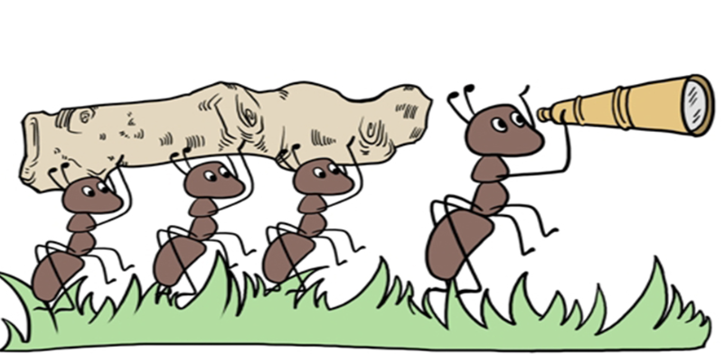

不知道你发现没有：干活越多越努力的人往往拿的越少，而那些整体什么都不干的人拿的却比你多。生物学家做过一个实验，他们发现蚂蚁在找到大量食物后，大多数都变得非常兴奋，不停地往巢里搬运，但却有那么几只蚂蚁什么也不干，直到实验人员拿走食物，勤快的蚂蚁瞬间乱作一团，惊慌失措。反而是懒蚂蚁带领队伍找到了新食物，原来那些蚂蚁并不是在偷懒，而是在观察和思考，这就是“懒蚁效应”。耶鲁教授柯维博士曾说：绝大部分人都是低水平的勤奋者，依靠盲目努力，而真正的高手靠的是方法和目标选择，他研究大量成功人士后发现，真正聪明的人，从来不会盲目地消耗自己时间和精力，而是在高价值区做正确的事情，他说你必须把时间放在真正值得关注，可以长期积累的事情上，才能全力以赴，持之以恒的付诸实现，获得内心的满足。

记录每天值得分享的内容，每天 8 点发布。

欢迎投稿，推荐或自荐文章/工具，请[提交 issue](https://github.com/fullstackren/daily/issues)。

（完，祝好！）
