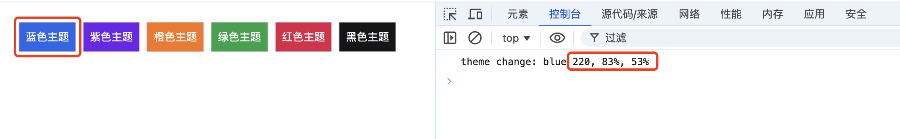
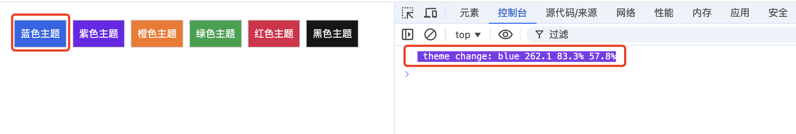
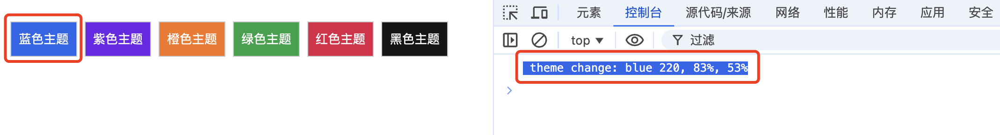

# 使用 console.log 反馈主题，提升开发体验

项目开发过程中，遇到 UI 状态发生变化，但是主题更新却存在问题，那我该如何通过界面快速排查故障呢？

我定义一个方法，方法的参数一是命名颜色（如 `blue`），参数二是该命名颜色对应的 HSL 颜色字符串（如 `220, 83%, 53%`），每次点击切换主题时，将这两个参数传入，通过 `console.log` 输出当前主题。

```js
function themeChange(colorName, colorHslString) {
    console.log(
        `theme change: ${colorName} ${colorHslString}`
    );
}
```

这时，我通过点击切换主题的按钮并观察错误，问题来了：当我通过控制台来查看界面 UI 正在执行的操作是否与代码正在执行的操作相匹配时，无法判断。这些颜色值难以辨别，因为我们无法直观地看到颜色值（你知道 `262.1 83.3% 57.8%` 是蓝色颜色值吗？）。



这时，我想到一个办法，通过 `console.log` 输出颜色值，并使用颜色值作为背景色，这样就可以直观地看到当前主题的颜色值了。

我们只需更新 `console.log()` 语句，将日志语句的样式设置与界面 UI（切换主题按钮的背景色）的颜色值相同，从而非常容易在视觉上进行区分。

```js
function themeChange(colorName, colorHslString) {
    console.log(
        `%c theme change: ${colorName} ${colorHslString}`,
        `color: white; background-color: hsl(${colorHslString})`
    );
}
```



现在，可以一眼就能看出点击切换主题的颜色值与参数二的颜色值不匹配，很清楚地知道错误在哪里。查看代码，修复错误，然后返回界面 UI 并再次测试：



好的体验在于开发过程中不断优化开发环境，提升开发体验。直观体验，可查看[示例源码](https://github.com/fullstackren/daily/blob/main/playgournd/css/daily-0002-console-log/index.html)。

记录每天值得分享的内容，每天 8 点发布。

欢迎投稿，推荐或自荐文章/工具，请[提交 issue](https://github.com/fullstackren/daily/issues)。

（完，祝好！）